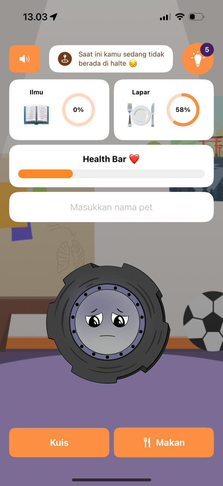
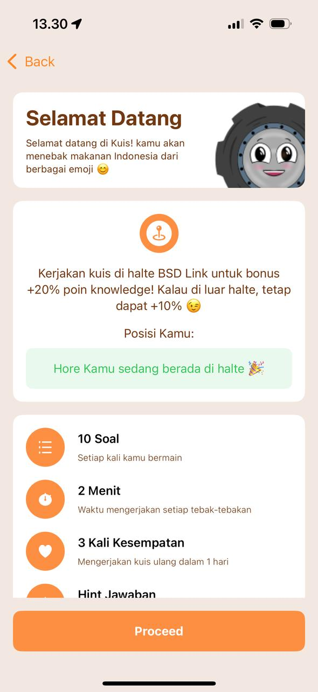
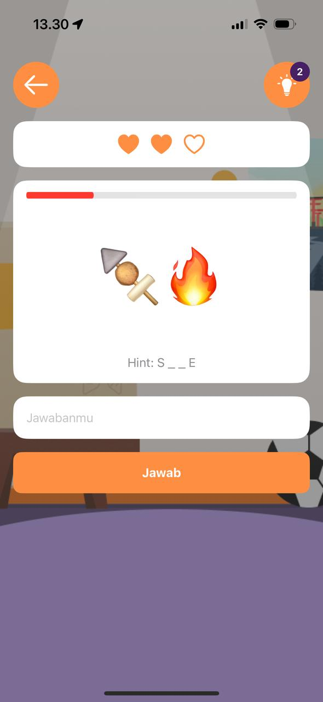
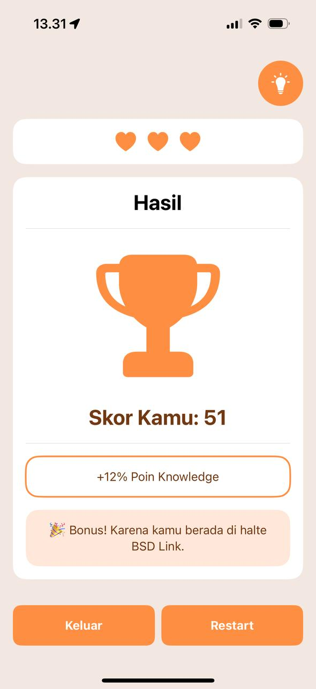

# 🐾 PetRoll🛞

**PetRoll** is a simple virtual pet game built with SwiftUI, designed to make the experience of waiting for the BSD Link more fun. Feed your pet, guess Indonesian food through emoji quizzes, and unlock special content when you’re at the BSD Link stop!

---

## 📱 Preview

| Home Screen | Preview Quiz | Emoji Quiz | Finish Quiz |
|-------------|-----------|-------------|-------------|
|  |  |  |  |

---

## 🎯 Features

- 🐶 Virtual pet with simple, intuitive interactions
- 🍛 Emoji-based food guessing quiz (local Indonesian cuisine!)
- 📍 Location-aware content unlock using CoreLocation
- 🎨 Friendly and colorful UI using SwiftUI

---

## 🚀 Technologies Used

| Tool | Description |
|------|-------------|
| **Swift** | Core programming language |
| **SwiftUI** | Declarative UI framework for building the interface |
| **CoreLocation** | Detect user’s location and provide dynamic content when near BSD Link stop |

---

## 🧠 Problem & Solution

**Problem:** People often experience boredom while waiting for the BSD Link due to unpredictable schedules.

**Solution:** PetRoll provides light interaction (feeding, quizzes) to make the waiting moment more fun, especially enhanced when users are detected to be near the BSD Link stop (The Breeze).

---

## 🧩 App Architecture (MVVM + Location Logic)
